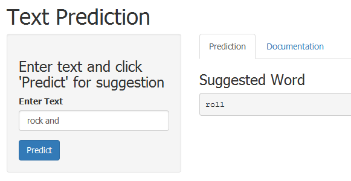

Predictive Text Shiny App - JHU DSS Capstone Project
========================================================
author: Keith G. Williams
date: August 23, 2015

Overview
========================================================

- A predictive text application asks the user to input some text, then the next word is predicted.
- Possilbe uses are for auto-complete for texting on a mobile phone or for searches in a search engine.
- A mock-up for such an app was built using Shiny.

The Model
========================================================
- An n-gram model with additive (laplace) smoothing was chosen as the language model.
- N-grams are collections of phrases of length $n$. Given the first $n - 1$ words, the $nth$ word can be predicted using Markov chain probabilities.

Robustness
========================================================
- Additive (laplace) smoothing is used to make the model more robust to unseen data.
- Since an input word might not be seen in the training sample, probability density is shifted away from known n-grams to unknown n-grams. This allows the model to handle input words unseen or sufficiently infrequent in the training data.

Using the App
========================================================

- To use the app, input any number of words into the input box.
- Click 'predict' to see the prediction of the next word.
- The predicted word will be output to the right.

Try it Out
========================================================
[Try it out!](https://keithgw.shinyapps.io/application)
- For a production model implementation, predictions should pop up instantaneously as the user inputs letters.
- Accuracy would be greatly improved by training on a larger data set. This model is limited by memory, so distributed computing would be needed to improve prediction accuracy.
